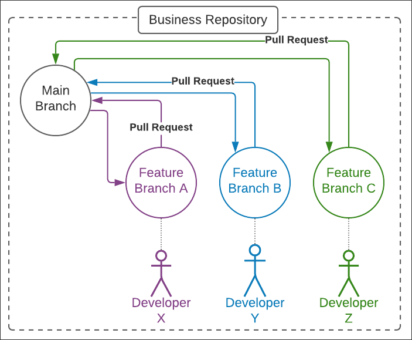
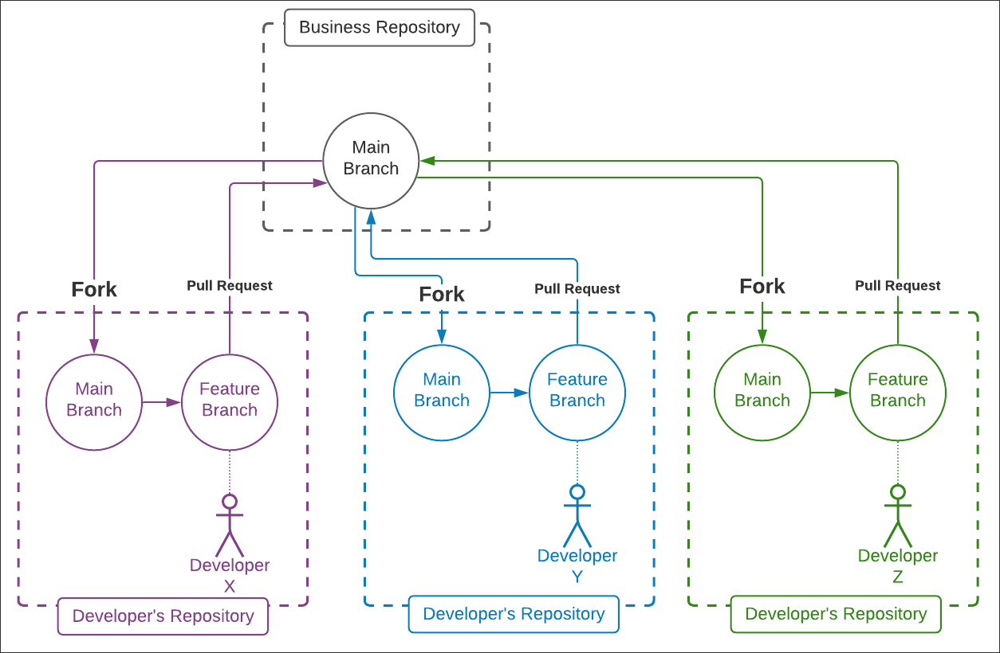

Feature branching is a game-changing aspect of modern software development. Being able to have a developer implement a new feature in a body of code in a safe, independent, isolated manner using Git branching is an overall positive approach to the way companies make software.

Over the years, two techniques of feature branching have emerged. One is what I call _branching from repo_. The other is _branching from fork_. Let’s explore each technique, as well as their benefits and tradeoffs.

<!-- more --> 

## Branching from repo 

Branching from repo is a pattern in which feature branches are created off an existing branch in a business’s repository and then assigned to or assumed by a particular developer for implementation. 

> Figure 1: The branching from repo pattern is used to implement feature branches created from a particular branch in a business’s repository.

The branching from repo pattern is confined to creating feature branches that are within the boundaries of a particular business’s repository. Thus, only personnel or services that have the proper permissions for working that repository can create a particular feature branch. 

The important thing to understand about branching from repo is that all the work that goes with creating the feature branch, developing the feature’s code, and then issuing the pull request for the completed code is done from within the boundary of the given repository. Those people on the “outside” have no ability to contribute changes.

## Branching from fork 

In the branching from fork pattern, a developer interested in adding to and improving upon code in a given repository forks the code into their own repository. Then, the developer creates branches against the forked code.

> Figure 2: Developers use the branching from fork pattern to fork code from the business’s repository into the developer’s external repository to then create a feature branch.

Once work on a given branch is complete, the developer makes a pull request to merge the code back into the originating repository.

> Figure 3: GitHub supports pull requests for merging code between repositories in separate accounts.

The important thing to understand about the branching from fork pattern is that it allows any developer to make improvements to code in an external repository in a controlled manner. All that’s required is view access to a repository of interest and then the cloning of the code.

Once the code is cloned, the developer is free to work on improvements according to their own software development process. The original repository is independent of the forked code; the only intersection between the two is when the pull request is made from the forked repository back to the originating repository.

## Advantages and tradeoffs 

Both patterns have advantages and trade-offs. Let’s examine them.

### Branching from repo is well suited to private governance

Branching from repo is well suited for companies that want to keep their software development process private and subject only to their own development and project management practices.

Typically, a feature branch is created to accommodate a request that exists in a company’s backlog of work. In some cases, a feature branch can be created ad hoc, but usually, they are created by a governing authority within the company, such as a project manager or tech lead. Either the feature branch is created directly or as an ancillary action taken by automation within a project management platform such as Jira. As such, branching from repo allows project managers and tech leads to exert a lot of control over who can work on code. Also, the governing authority can determine the status of the feature branch by viewing the code as well as the branch’s commit history.

The trade-off is that branching from repo requires that those working on the code have a known relationship to the repository from within the source control management service hosting the code. For example, if the code is hosted on GitHub, a developer must have permission to make commits to the feature branch. Typically, this means inviting the developer to be a direct contributor to the repository or a member of an organization associated with the project. While this degree of formality provides control, it also excludes the general public from working on the code in an ad hoc manner, so there is less opportunity to benefit from the informal interest of others. Fortunately, branching from fork addresses this shortcoming.

### Branching from fork is well suited to open-source development 

Branching from fork is well suited for volunteer-based open-source development. Branching from repo is pretty much a “We’re assigning you some code to work” approach. On the other hand, branching from fork says, “Here’s some code. Feel free to work on it, but you need to figure out what you want to work on to make it better.”

In order for a developer to improve code using branching from fork, they need to identify possible improvements. This can take many forms. For instance, a developer can find problems to solve by going over the list of open issues in the source control management service that’s hosting the code. Once an issue is identified, the developer can address it according to their own development style and timeframe.

In addition to addressing known issues, a developer can implement, in an unsolicited manner, a feature they would like to see in the code. There’s no need to ask for permission. All that needs to be done is to implement the feature and then submit a pull request back to the original project. At that point, it’s up to the project’s maintainers to use the improvement. If the unsolicited feature is not accepted, it still exists in the fork and is available to interested parties there.

One drawback of branching by fork is that making contributions can require a good deal of work. Regardless of whether the developer is working on a known issue, implementing an existing feature request, or offering an unsolicited improvement, they will still need to learn the code. That learning curve can be significant, particularly if the developer has limited access to others who are willing to help. Sometimes the help required to fill in the gaps might be available, but many times it’s not. If the documentation is poor or the code is cryptic, figuring out how to make a meaningful improvement can take a lot of time. As those who have worked with volunteers can attest, the best volunteer experience is the one that’s the easiest. The more difficult the undertaking, the greater the risk of losing the volunteer’s sense of investment.

Conversely, a developer working on a feature request according to the branching from repo pattern will usually be a member of the business or organization that owns the repository. Thus, they will usually enjoy the support of other members who have experience working with the code. There’s both formal and tribal knowledge that’s available, so things are easier.

Another drawback of branching from fork is that since anybody can make a contribution, anybody will. This means that the code submitted via a pull request will vary in quality: Some of it will be quite good, but some of it will be quite bad. This creates more work for those who actually have to review pull requests in order to make sure that a submission meets quality standards. While a certain degree of quality control can be accomplished using automation, there are still aspects of the pull request that will require human inspection, particularly if the code is complex.

In short, branching from fork allows more people to work on code in their own manner, but making meaningful contributions is harder for all parties involved.

## Putting it all together

The beauty of being able to branch source code is that it allows developers to work on code in a safe, controllable manner. Modern software development depends on branching.

The beauty of forking is that it provides a way for independent parties to work on an entire repository hosted in a source control management platform, such as GitHub or BitBucket, in an independent manner without affecting the original repository. Combining branching and forking creates a new dimension in software development.

Whether you use the branching from repo technique or the branching from fork technique, the important thing is that both methods provide developers a significant degree of independence while ensuring that the code that eventually makes its way into production will be the highest quality possible.

